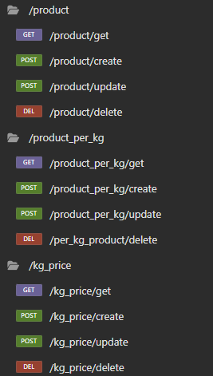
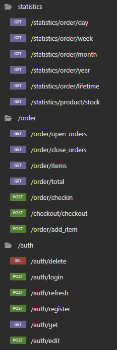

# PyCommander

`PyCommander` é um projeto de uma API backend para um sistema que poderia ser usado em um restaurante. Esse sistema implementa uma comanda virtual, permitindo que usuários, no caso, funcionários, cadastrem a comanda de um cliente, adicionem produtos, realizem o checkout das comandas e cadastrem produtos. Também é possível obter estatísticas sobre os usuários, como a média de dinheiro gasto, o tempo médio de duração da comanda e o estoque de produtos. O sistema fornece o valor total gasto em diferentes períodos, como 1, 7, 30 e 365 dias. Assim, ele pode ser usado não apenas para controlar as comandas, mas também para contribuir com a eficiência do negócio.

Para segurança, foi implementado um sistema com JWT (JSON Web Token). Isso permite que o usuário faça login e crie um token único, chamado de access token, para cada sessão. Para evitar que o usuário precise fazer login repetidas vezes, foi implementado um refresh token, que é usado para gerar um novo access token. Ambos os tokens, tanto o access token quanto o refresh token, possuem um tempo de expiração, o que ajuda a evitar possíveis ataques de segurança

Para o deploy da aplicação, foram criados dois servidores Docker: um responsável por executar o banco de dados e o outro, um servidor Python

### Objetivo

Este projeto tem como objetivo implementar todo o ciclo de desenvolvimento de uma API Backend, desde a criação do banco de dados, servidor em Python e, por fim, realizar o deploy em contêineres Docker

## Tecnologias usadas

Para este projeto, foram utilizadas as tecnologias `Python`, `Flask`, `JWT`, `Docker`, `MariaDB`, `SQL` e `WSL2`. A seguir, uma breve explicação sobre cada tecnologia e como ela foi usada no projeto

### Docker

Docker foi utilizado neste projeto para facilitar a implantação em um ambiente Linux. Com o Docker, é possível criar contêineres separados, o que permite o isolamento dos diferentes serviços necessários para o projeto. Implementei um contêiner para o MariaDB e outro para o Python, assim, cada contêiner tem seus próprios sistemas separados, o que proporciona um melhor controle do servidor

### Python

Python é uma linguagem de programação que foi utilizada no meu projeto para desenvolver a API. Nela, são implementadas todas as regras de negócio, além de controlar como os dados serão manipulados e gerenciar a segurança

### Flask, JWT (JSON Web Token)

Flask é um framework web em Python que permite criar sistemas web, assim como APIs. O Flask possui grande flexibilidade na organização do projeto e oferece um excelente gerenciamento de rotas. Com ele, foi implementado também o sistema de gerenciamento de JWT, que é fundamental para a segurança

### MariaDB, SQL

MariaDB foi o banco de dados relacional open source escolhido para este projeto. Ele utiliza a linguagem SQL para manipular os dados armazenados, o que permite que o sistema armazene e recupere informações de forma eficiente

# 📋 Configurando o .env
Para que este servidor seja executado corretamente, é necessário configurar o arquivo [_.env.example_](.env.example) presente na pasta raiz do projeto. Esse arquivo deve ser configurado e renomeado para [_.env_]() para que o sistema funcione adequadamente

Siga as instruções abaixo para configurar o [_.env_]() . Este arquivo é dividido em três principais regiões: Database, JWT e Default User

Na configuração do Database, você deve alterar `db_host_ip` para o IP e porta do banco de dados MariaDB. Também deve alterar `db_user` e `db_password` para os que você escolheu ao criar o banco de dados. Não é necessário alterar `db_name`
```yaml
# Database configuration
db_host_ip=127.0.0.1
db_port=3306
db_user=root
db_password=your_db_password
db_name=restaurant_db
```

Na configuração do JWT, apenas é necessário alterar a `JWT_SECRET_KEY` para uma senha secreta, a fim de evitar problemas de segurança. No entanto, se desejar, você pode experimentar outros valores: `JWT_ACCESS_TOKEN_EXPIRES_MINUTES`, que controla o tempo até que o token expire, e `JWT_REFRESH_TOKEN_EXPIRES_DAYS`, que controla a validade do token de refresh para gerar um novo access token
```yaml
# JWT configuration
JWT_SECRET_KEY=your_jwt_secret_key
JWT_ACCESS_TOKEN_EXPIRES_MINUTES=30
JWT_REFRESH_TOKEN_EXPIRES_DAYS=7
```

Na configuração do Default User, os valores são usados para criar um usuário admin padrão ao iniciar o servidor e o banco de dados pela primeira vez. É importante alterar esse usuário o mais rápido possível após criar o servidor
```yaml
# Default user
DEFAULT_USER=default_user
DEFAULT_PASSWORD=default_password
```

# 🔧 Instalação

## Instalação do Docker (Recomendado)

O Docker é um software de virtualização de contêineres, permitindo criar ambientes isolados para cada parte do projeto. Aqui, vou dar uma breve explicação de como executar o PyCommander em um ambiente Docker

Primeiramente, certifique-se de que tem o Docker instalado em um ambiente Linux, preferencialmente Ubuntu. Isso também pode ser feito em um ambiente WSL2 no Windows, que foi utilizado para este projeto

Caso não tenha instalado, siga o passo a passo presente em [docs.docker.com/engine/install](https://docs.docker.com/engine/install/)

```bash
# Verifica se o docker esta instalado
docker --version

# Baixa a imagem do banco de dados MariaDB
docker pull mariadb:latest

# Primeira execução do MariaDB; substitua <your_password_here> pela sua senha
docker run --name mariadb-container -p 3306:3306 -v /path/to/data:/var/lib/mysql -e MYSQL_ROOT_PASSWORD=<your_password_here> -d mariadb

# Inicia o banco de dados
docker start mariadb-container
```

Com o MariaDB instalado corretamente, siga para a instalação do contêiner Python:

```bash
# Primeiramente, faça um git clone desse repositório para o seu ambiente Linux
git clone https://github.com/LucasKalil-Programador/PyCommander.git

# Configure o .env.example
nano .env.example

# Não se esqueça de configurar corretamente e depois altere o nome do arquivo para .env
mv .env.example .env

# Navegue até a pasta do projeto 
cd PyCommander

# Crie a imagem do contêiner com as especificações presentes no Dockerfile
docker build -t py_commander_app .

# Execute o contêiner recém-criado
docker run --rm -p 8000:8000 -v $(pwd)/.env:/app/.env py_commander_app
```

Com isso, você deve ter um banco de dados MariaDB rodando na porta 3306 e um servidor Python na porta 8000

## Instalação Linux/Windows

Caso prefira instalar diretamente em um ambiente Linux ou Windows, siga os seguintes passos:

Instale o [Python3](https://www.python.org/downloads/) e o [MariaDB](https://mariadb.com/kb/en/getting-installing-and-upgrading-mariadb/) seguindo seus respectivos passos a passo.

Com o Python e o MariaDB instalados:

#### Linux:
```bash
# Clone o repositório do projeto
git clone https://github.com/LucasKalil-Programador/PyCommander.git

# Atualize os pacotes
sudo apt update && sudo apt upgrade

# Instale dependências para a build do Python
sudo apt install python3-dev build-essential libmariadb-dev libmariadb-dev-compat python3 python3-venv

# Crie um ambiente Python isolado
python3 -m venv .venv

# Ative o ambiente virtual
source .venv/bin/activate

# Baixe os requisitos
pip install -r requirements.txt

# Configure o .env.example
nano .env.example

# Não se esqueça de configurar corretamente e depois altere o nome do arquivo para .env
mv .env.example .env

# Execute o projeto
python3 main.py
```
Para Linux, você ainda tem a opção de executar em um servidor Gunicorn. A vantagem dessa abordagem é a possibilidade de executar em múltiplas threads, respondendo às requests. Com a instalação via Docker, o Gunicorn já é implementado por padrão
```bash
# Instale o Gunicorn
pip install gunicorn

# Rode o projeto com o comando. Este comando executa 8 workers, o que garante melhor performance para o servidor
gunicorn -w 8 -b 127.0.0.1:8000 main:app
```

#### Windows
```bash
# Clone o repositório do projeto
git clone https://github.com/LucasKalil-Programador/PyCommander.git

# Instale o Virtualenv (caso não tenha)
pip install virtualenv

# Navegue até o diretório do projeto
cd PyCommander

# Crie um ambiente Python isolado
python -m venv .venv

# Ative o ambiente virtual
.venv\Scripts\activate

# Configure o .env.example
nano .env.example

# Não se esqueça de configurar corretamente e depois altere o nome do arquivo para .env
mv .env.example .env

# Execute o projeto
python main.py
```

# ⚙️ Demonstração

A figura a seguir demonstra que as rotas /product, /product_per_kg e /kg_price são muito semelhantes. Todas possuem as rotas de criação, edição, atualização e exclusão



As rotas /statistics, /order e /auth são mais complexas e possuem mais endpoints. Um frontend que faria uso dessa API utilizaria essas funções para manipular os dados



# Conclusão   

O sistema implementado foi muito importante para o estudo de diversas tecnologias diferentes, e os aprendizados que tive com esse projeto foram significativos. Tecnologias como Docker, Python e MariaDB contribuíram para que esse projeto ficasse robusto. Com mais alguns ajustes, acredito que seria possível utilizá-lo em um serviço real

# ✒️ Autor

Lucas Guimarães Kalil 

E-Mail - lucas.prokalil2020@outlook.com

[Linkedin](https://www.linkedin.com/in/lucas-kalil-436a6220a/) | [GitHub](https://github.com/LucasKalil-Programador)